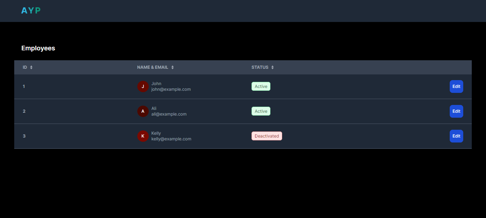

# My AYP Application
     

A simple Next.js application that can manage employees

## Features

- Web browser light/dark theme design
- Redux state management
- Jest unit test
- Pre-commit hook

## Screenshots
##### Dark Theme

##### Light Theme


## Getting Started

The project required Next.js >=14.0.3.

First, run the development server:

```bash
npm run dev
# or
yarn dev
```

Open [http://localhost:3000](http://localhost:3000) with your browser to see the result.

This project uses [`next/font`](https://nextjs.org/docs/basic-features/font-optimization) to automatically optimize and load Inter, a custom Google Font.

## Running Tests

To run tests, run the following command

```bash
  npm run test
  or
  yarn test
```

## Src Folder Structure Overview
```
📦src
 ┣ 📂app
 ┃ ┣ 📂api
 ┃ ┃ ┗ 📂employee
 ┃ ┃ ┃ ┣ 📂[id]
 ┃ ┃ ┃ ┃ ┗ 📜route.ts
 ┃ ┃ ┃ ┣ 📜employeeTestData.json
 ┃ ┃ ┃ ┗ 📜route.ts
 ┃ ┣ 📜favicon.ico
 ┃ ┣ 📜globals.css
 ┃ ┣ 📜layout.tsx
 ┃ ┣ 📜page.tsx
 ┃ ┗ 📜StoreProvider.tsx
 ┣ 📂components
 ┃ ┣ 📜Button.tsx
 ┃ ┣ 📜EmployeeForm.tsx
 ┃ ┣ 📜EmployeeTable.tsx
 ┃ ┣ 📜Header.tsx
 ┃ ┣ 📜InputField.tsx
 ┃ ┣ 📜Modal.tsx
 ┃ ┣ 📜SkeletonTable.tsx
 ┃ ┣ 📜ToastMessage.tsx
 ┃ ┗ 📜Toggle.tsx
 ┣ 📂constants
 ┃ ┗ 📜employee.enum.ts
 ┣ 📂hooks
 ┃ ┣ 📜index.ts
 ┃ ┗ 📜useToggle.ts
 ┣ 📂interfaces
 ┃ ┗ 📜employee.interface.ts
 ┣ 📂redux
 ┃ ┣ 📂features
 ┃ ┃ ┗ 📂employee
 ┃ ┃ ┃ ┗ 📜employeeSlice.ts
 ┃ ┣ 📜hook.ts
 ┃ ┗ 📜store.ts
 ┣ 📂utils
 ┃ ┣ 📜colors.utils.ts
 ┃ ┗ 📜index.ts
 ┗ 📂__test__
 ┃ ┗ 📂components
 ┃ ┃ ┣ 📂__snapshots__
 ┃ ┃ ┃ ┣ 📜EmployeeForm.test.tsx.snap
 ┃ ┃ ┃ ┗ 📜EmployeeTable.test.tsx.snap
 ┃ ┃ ┣ 📜Button.test.tsx
 ┃ ┃ ┣ 📜EmployeeForm.test.tsx
 ┃ ┃ ┣ 📜EmployeeTable.test.tsx
 ┃ ┃ ┣ 📜InputField.test.tsx
 ┃ ┃ ┣ 📜Modal.test.tsx
 ┃ ┃ ┗ 📜Toggle.test.tsx
```

## Components Overview

#### Modal
Simple hoc component, use modal anywhere with given children component which create reusablility.
```Typescript
import classnames from 'classnames';

type Modal = {
  children: JSX.Element;
  visible?: boolean;
  onDismiss?: () => void;
};

export const Modal = ({
  onDismiss = () => void 0,
  visible = false,
  children,
}: Modal) => {
  return (
    <div
      role='modal'
      onClick={onDismiss}
      className={`${classnames({
        hidden: !visible,
      })} fixed !inset-0 z-50 !m-0 flex items-center justify-center bg-black bg-opacity-60`}
    >
      <div onClick={(e) => e.stopPropagation()}>{children}</div>
    </div>
  );
};
```

#### InputField
An input wrapper that will be used in this project. Ensure design consitency and maintainability.

```Typescript
import {
  DetailedHTMLProps,
  HTMLInputTypeAttribute,
  InputHTMLAttributes,
} from 'react';

type InputText = DetailedHTMLProps<
  InputHTMLAttributes<HTMLInputElement>,
  HTMLInputElement
>;

type InputField = InputText & {
  label: string;
  type?: HTMLInputTypeAttribute;
};

export const InputField = (props: InputField) => {
  const { label, type = 'text', ...inputProps } = props;

  return (
    <div>
      <label className='mb-2 block text-sm font-medium text-black dark:text-white'>
        {label}
      </label>
      <input
        {...inputProps}
        type={type}
        className='block w-full rounded-lg border-2 border-gray-200 p-2.5 text-sm text-black outline-none'
      />
    </div>
  );
};
```

#### Toggle
A checkbox component that created with new design and easier to use with implemented the useToggle custom hooks.
```Typescript
import { useToggle } from '@/hooks';

type Toggle = {
  label?: string;
  checked?: boolean;
  labelCapitilize?: boolean;
  onChange?: (callback: boolean) => void;
};

export const Toggle = ({
  label = '',
  checked = false,
  labelCapitilize = false,
  onChange = () => void 0,
}: Toggle) => {
  const { visible, toggle } = useToggle(checked);

  return (
    <label className='relative inline-flex cursor-pointer items-center'>
      <input
        type='checkbox'
        checked={visible}
        className='peer sr-only'
        onChange={(e) => {
          toggle();
          onChange(e.target.checked);
        }}
      />
      <div className="peer h-6 w-11 rounded-full bg-slate-900 after:absolute after:start-[2px] after:top-[2px] after:h-5 after:w-5 after:rounded-full after:border after:border-gray-300 after:bg-white after:transition-all after:content-[''] peer-checked:bg-green-600 peer-checked:after:translate-x-full peer-checked:after:border-white peer-focus:outline-none rtl:peer-checked:after:-translate-x-full"></div>
      <span
        className={`ms-3 select-none text-sm font-medium ${
          labelCapitilize ? 'capitalize' : ''
        }`}
      >
        {label}
      </span>
    </label>
  );
};

```

## Acknowledgements

 - [How to use Redux in Next.js](https://blog.logrocket.com/use-redux-next-js/)
 - [Redux Toolkit Setup with Next.js](https://redux.js.org/usage/nextjs)
 - [Jest and React Testing Library](https://nextjs.org/docs/pages/building-your-application/optimizing/testing#jest-and-react-testing-library)
 - [Next.js Project Structure](https://nextjs.org/docs/getting-started/project-structure)

## API Reference

#### Get all employees

```http
  GET /api/employee
```

#### Get employee

```http
  GET /api/employee/${id}
```

| Parameter | Type     | Description                       |
| :-------- | :------- | :-------------------------------- |
| `id`      | `string` | **Required**. Id of employee to fetch |

## Authors
- [@junhuito](https://github.com/junhuito)


## Support

For support, email junhuito5771@gmail.com
